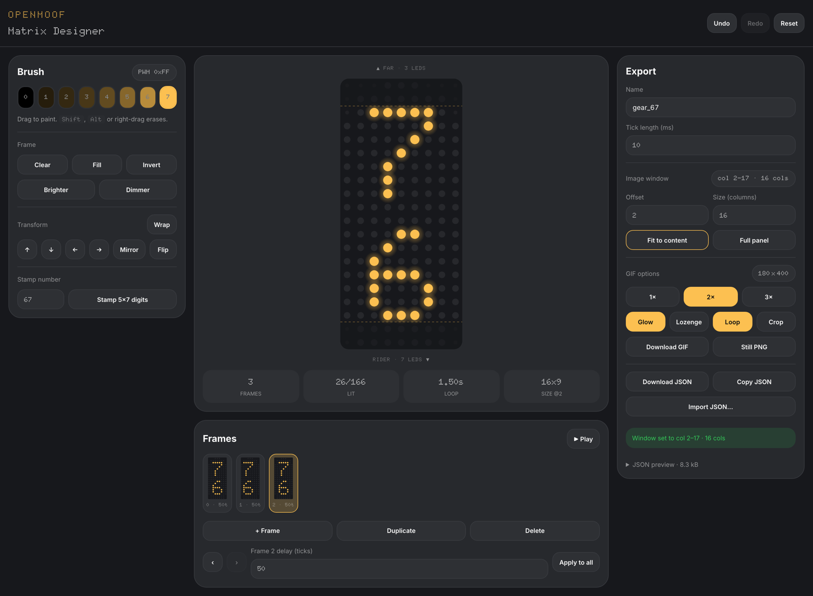

# Matrix Designer


Draw pictures and animations for the 9 by 20 LED matrix panel, then download
them as a JSON file and an animated GIF.

[Open the app](https://openmoof.github.io/MatrixDesigner/)



## Using it

The panel appears on screen at its real shape, a lozenge of 166 LEDs with the
corners left dark because nothing is wired there. Drag across it to paint. Hold
Shift or Alt while you drag to erase, and pick one of eight brightness levels
from the row of swatches.

Build an animation by adding frames along the bottom strip. Each frame has its
own delay, and Play runs the whole thing at real speed so you can see how it
reads before you export anything.

The tools on the left shift, mirror, flip and invert what you have drawn, or
stamp a one or two digit number using the built in glyphs. If your picture only
needs part of the panel, set the image window on the right, or press Fit to
content and let the app size it around your artwork for you.

When you are happy, Download JSON gives you the animation as data and Download
GIF gives you a looping preview of it. There is a Still PNG button for a single
frame, and Import JSON loads any file the app made so you can keep working on
it later.

Number keys 0 to 7 pick a brightness. Left and right arrows step through
frames, Space plays and pauses, and Cmd Z undoes.

## One thing worth knowing

Frame delays are counted in ticks, and the panel does not say how long a tick
lasts. The app assumes ten milliseconds so it can time the preview and the GIF.
If that turns out to be wrong, change the tick length in the Export panel and
everything retimes to match.

## Running it yourself

You need Node 20 or newer.

```bash
npm install
npm run dev
```

The app will be at http://localhost:5173.

Pushing to `main` builds the app and publishes it to GitHub Pages
automatically. On a fresh clone, go to Settings, then Pages, and set the source
to GitHub Actions once.

## Licence

MIT
